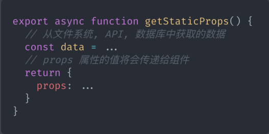
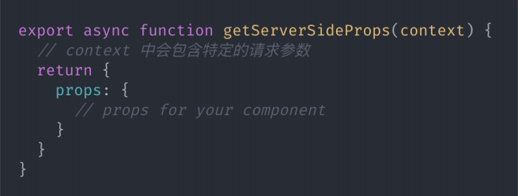
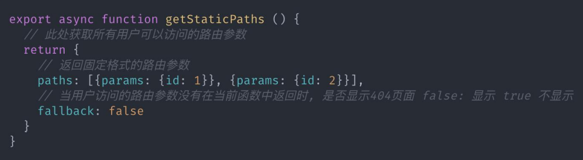
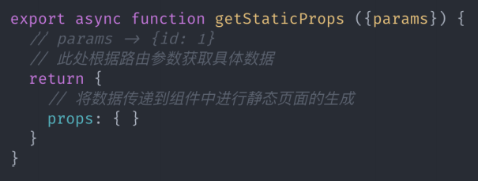

## 概念
- Next.js 是 React 服务端渲染应用框架. 用于构建 SEO 友好的 SPA 应用

## 优点
1. 支持两种预渲染方式, 静态生成和服务器端渲染. 
2. 基于页面的路由系统, 路由零配置
3. 自动代码拆分. 优化页面加载速度.
4. 支持静态导出, 可将应用导出为静态网站.
5. 内置 CSS-in-JS 库 styled-jsx
6. 方案成熟, 可用于生产环境, 世界许多公司都在使用
7. 应用部署简单, 拥有专属部署环境 Vercel, 也可以部署在其他环境

## 预渲染
在 Next.js 中支持两种形式的预渲染: 静态生成和服务器端渲染.
静态生成和服务器端渲染是生成 HTML 的时机不同.
静态生成: 静态生成是在构建时生成 HTML. 以后的每个请求都共用构建时生成好的 HTML.
服务器端渲染: 服务器端渲染是在请求时生成 HTML. 每个请求都会重新生成 HTML

## 选型
Next.js 允许开发者为每个页面选择不同的预渲染方式. 不同的预渲染方式拥有不同的特点. 应根据场景进行渲染. 
但建议大多数页面建议使用静态生成.
静态生成一次构建, 反复使用, 访问速度快. 因为页面都是事先生成好的.
适用场景：营销页面、博客文章、电子商务产品列表、帮助和文档
服务器端渲染访问速度不如静态生成快, 但是由于每次请求都会重新渲染, 所以适用数据频繁更新的页面或页面内容随请求变化而变
化的页面

## 静态生成 getStaticProps
getStaticProps 方法的作用是获取组件静态生成需要的数据. 并通过 props 的方式将数据传递给组件.
该方法是一个异步函数, 需要在组件内部进行导出.
在开发模式下, getStaticProps 改为在每个请求上运行

## 服务器端渲染 getServerSideProps
如果采用服务器端渲染, 需要在组件中导出 getServerSideProps 方法

## 基于动态路由的静态生成
基于参数为页面组件生成HTML页面，有多少参数就生成多少HTML页面
在构建应用时, 先获取用户可以访问的所有路由参数, 再根据路由参数获取具体数据, 然后根据数据生成静态 HTML.
1. 创建基于动态路由的页面组件文件, 命名时在文件名称外面加上[], 比如[id].js
2. 导出异步函数 getStaticPaths, 用于获取所有用户可以访问的路由参数

3. 导出异步函数 getStaticProps, 用于根据路由参数获取具体的数据

注: getStaticPaths 和 getStaticProps 只运行在服务器端, 
永远不会运行在客户端, 甚至不会被打包到客户端
JavaScript 中, 意味着这里可以随意写服务器端代码, 比
如查询数据库