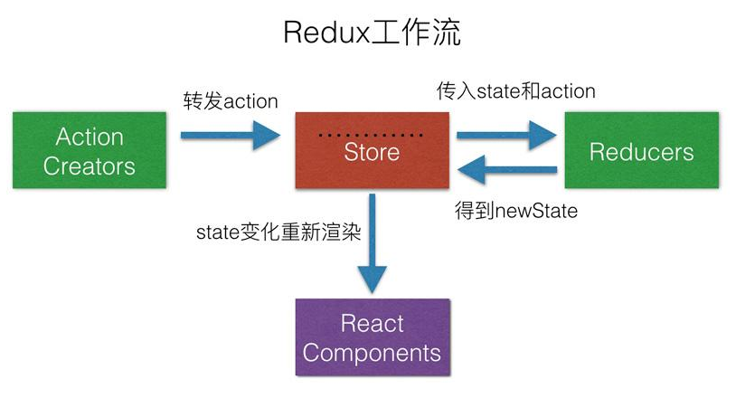

## Redux应用场景
- Redux的出现就是为了解决state里的数据流动问题，在React中，数据在组件中是单向流动的，由父到子进行传递，未解决兄弟组件传参困难，出现了redux
  
## 设计思想
- Redux是将整个应用状态存储到到一个地方，称为store
- 里面保存一棵状态树state tree
- 组件可以派发 dispatch 行为 action 给 store,而不是直接通知其它组件
- 其它组件可以通过订阅 store 中的状态(state)来刷新自己的视图



## Redux三大原则
1. 整个应用的 state 被储存在一棵 object tree 中，并且这个 object tree 只存在于唯一一个 store 中
2. State 是只读的，惟一改变 state 的方法就是触发 action，action 是一个用于描述已发生事件的普通对象 使用纯函数来执行修改，为了描述action如何改变state tree ，你需要编写 reducers
3. 单一数据源的设计让React的组件之间的通信更加方便，同时也便于状态的统一管理

## 原生用法
```js
let counterValue = document.getElementById('counter-value');
let incrementBtn = document.getElementById('add-btn');
let decrementBtn = document.getElementById('minus-btn');

const INCREMENT = 'INCREMENT';
const DECREMENT = 'DECREMENT';
let initState = { number: 0 };

const reducer = (state = initState, action) => {
    switch (action.type) {
        case INCREMENT:
            return { number: state.number + 1 };
        case DECREMENT:
            return { number: state.number - 1 };
        default:
            return state;
    }
}
let store = createStore(reducer);
function render() {
    counterValue.innerHTML = store.getState().number + '';
}
store.subscribe(render);
render();
incrementBtn.addEventListener('click', function () {
    store.dispatch({ type: INCREMENT });
});
decrementBtn.addEventListener('click', function () {
    store.dispatch({ type: DECREMENT });
});
```

## bindActionCreators
```js
import { createStore,bindActionCreators} from '../redux';
function add() {
    return { type: 'ADD' };
}
function minus() {
    return { type: 'MINUS' };
}
const actions = { add, minus };
const boundActions = bindActionCreators(actions, store.dispatch);
boundActions.add()
```

## combineReducers
```js
import { combineReducers} from '../../redux';
export default combineReducers({
    reducer1,
    reducer2
});
```

## react-redux 结合了react 提供了一些api 使得在react中使用redux更简便
```js
// 顶层使用 provider 包裹
import { Provider } from './react-redux';
import store from './store';
<Provider store={store}>
    <Counter1 />
    <Counter2 />
</Provider>

// 组件中使用connect高阶函数包裹组件
let mapStateToProps = (state) => ({number:state.counter1})
export default connect(
    mapStateToProps,
    actions
)(Counter1)
```

## 函数式组件 hooks
```js
let state = useSelector(state=>state.counter1);
let dispatch = useDispatch();
```

## Redux中间件
- 没有中间件的运用,redux 的工作流程是这样 action -> reducer，这是相当于同步操作，由dispatch 触发action后，直接去reducer执行相应的动作
- 中间件可以改变数据流，添加异步操作，action -> middlewares ->reducer ,当middlewares完成之后再去触发reducer执行

## 使用中间件
```js
import { createStore, applyMiddleware } from 'redux';
import reducer from './reducers';
import logger from 'redux-logger';
import promise from 'redux-promise';
import thunk from 'redux-thunk';
let store = applyMiddleware(promise,thunk,logger)(createStore)(combinedReducer);
```

## 实现中间件
```js
// redux-logger
export default  (api) => (next) => (action) => {
  console.log(api.getState());
  next(action);
  console.log(api.getState());
  return action;
};

// redux-promise
function promise({getState,dispatch}){
    return function(next){//原生的store.dispatch
        let returnDispatch =  function(action){//=改造后最终的store.dispatch
            console.log('promise returnDispatch');
            if(typeof action.then ==='function'){
                action.then((newAction)=>{
                    dispatch(newAction);//重新派发
                });
            }else{
                next(action);
            }
        }
        return returnDispatch;
    }
}
const actions = {
    promiseAdd() {
        return {
            type: types.ADD1,
            payload: new Promise((resolve, reject) => {
                setTimeout(() => {
                    let result = Math.random();
                    if (result > .5) {
                        resolve(result);
                    } else {
                        reject(result);
                    }
                }, 1000);
            })
        }
    },
}

// redux-thunk
export default ({ dispatch, getState }) => (next) => (action) => {
  if (typeof action === 'function') {
      return action(dispatch, getState);
  }
  return next(action);
};
const actions = {
  thunkAdd() {
     return function (dispatch) {
         setTimeout(() => {
             dispatch({ type: types.ADD1 });
         }, 1000);
     }
  },
}
// 
```

## connected-react-router
```js
// 1. 监听路由变化 当路由变化时 dispatch locationChange 事件 修改 store.router 中location 跟 action的值
<Provider store={store}>
    <ConnectedRouter history={history}>
        ...
    </ConnectedRouter>
</Provider>

// 2. 创建一个history对象
import { createBrowserHistory } from 'history'
let history = createBrowserHistory();
export default history;

// 3. 在 store 中添加一个路由的reducer 添加 router 对象 里边存储着当前的location 跟 action
import { combineReducers} from 'redux'
import { connectRouter } from 'connected-react-router'
import counter from './counter';
import history from '../../history';
let reducers = {
    router: connectRouter(history),
    counter
};
let rootReducer = combineReducers(reducers);
export default rootReducer;

// 4. 在 reducer 中使用 router跳转api 他会派发一个action type为 CALL_HISTORY_METHOD
import { push } from 'connected-react-router';
export default {
    go(path) {
        return push(path);
    }
}

// 5. 改中间件负责处理 type 为 CALL_HISTORY_METHOD 的 action 进行路由跳转
import { applyMiddleware, createStore } from 'redux'
import { routerMiddleware } from 'connected-react-router'
import history from '../history';
import reducers from './reducers';
const store = applyMiddleware(routerMiddleware(history))(createStore)(reducers);
window.store = store;
export default store;
```