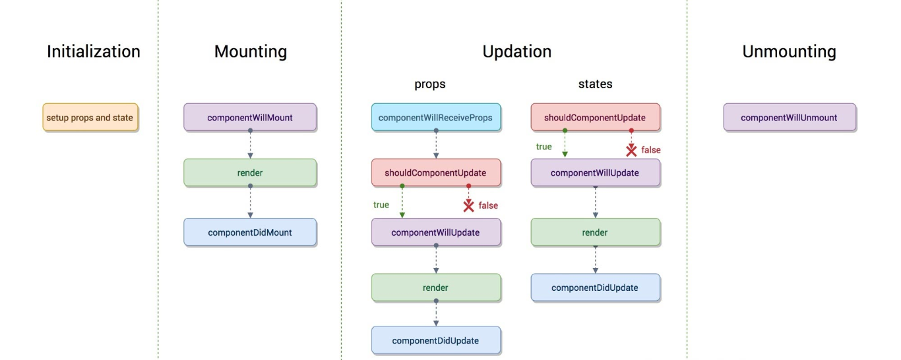
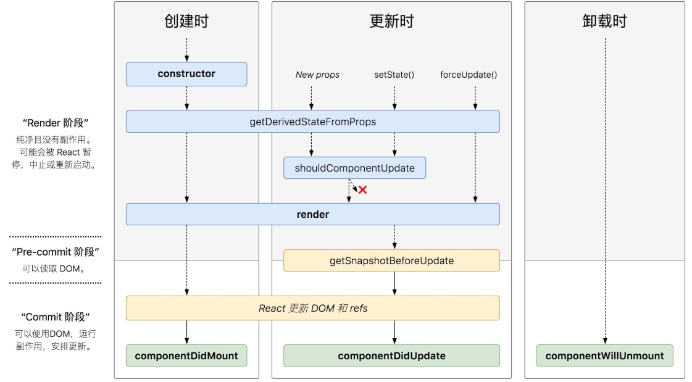

## setState 的更新可能是异步的

- 出于性能考虑，React 可能会把多个 setState() 调用合并成一个调用
- 因为 this.props 和 this.state 可能会异步更新，所以你不要依赖他们的值来更新下一个状态
- 可以让 setState() 接收一个函数而不是一个对象。这个函数有上一个 state 作为第一个参数

```js
this.state = { number: 0 };
this.setState({ number: this.state.number + 1 });
console.log(this.state.number); // 0 不会输出 1
this.setState({ number: this.state.number + 1 });
// 最后 number的值为1 不是 2

this.setState((state) => ({ number: state.number + 1 }));
this.setState((state) => ({ number: state.number + 1 }));
// 最后 number 的值为2
```

## 事件处理

- React 事件的命名采用小驼峰式（camelCase），而不是纯小写。
- 使用 JSX 语法时你需要传入一个函数作为事件处理函数，而不是一个字符串
- 你不能通过返回 false 的方式阻止默认行为。你必须显式的使用 preventDefault

```js
<button onClick={this.handleClick}>+</button>;
this.handleClick = (e) => {
  e.preventDefault();
};
```

## 事件处理中的 this 指向

```js
class LoggingButton extends React.Component {
  handleClick() {
    console.log('this is:', this);
  }
  // 1. 通过箭头函数绑定 this 推荐
  handleClick1 = () => {
    console.log('this is:', this);
  };
  render() {
    // 2. onClick={this.handleClick.bind(this) 通过 bind 显示绑定 this
    return (
      // 3. 匿名函数绑定 this
      <button onClick={(event) => this.handleClick(event)}>Click me</button>
    );
  }
}
```

## 事件处理函数传参

```js
// 1. 匿名函数
<button onClick={(event) => this.handleClick('1', event)}>Click me</button>
// 2. bind
<button onClick={this.handleClick.bind(this, '1')}>Click me</button>
```

## ref

- 普通 html 元素 使用 ref

```js
class Sum extends React.Component {
  constructor(props) {
    super(props);
    this.a = React.createRef();
    this.b = React.createRef();
    this.result = React.createRef();
  }
  handleAdd = () => {
    let a = this.a.current.value;
    let b = this.b.current.value;
    this.result.current.value = a + b;
  };
  render() {
    return (
      <>
        <input ref={this.a} />+<input ref={this.b} />
        <button onClick={this.handleAdd}>=</button>
        <input ref={this.result} />
      </>
    );
  }
}
```

- 当 ref 属性用于自定义 class 组件时，ref 对象接收**组件的挂载实例**作为其 current 属性

## Ref 转发 用于函数式组件

- 你不能在函数组件上使用 ref 属性，因为他们没有实例
- Ref 转发是一项将 ref 自动地通过组件传递到其一子组件的技巧
- Ref 转发允许某些组件接收 ref，并将其向下传递（换句话说，“转发”它）给子组件

```js
const TextInput = React.forwardRef((props, ref) => <input ref={ref} />);
const Form = () => {
  let input = React.createRef();
  return (
    <>
      <TextInput ref={input} />
    </>
  );
};
```

## React 生命周期

- 旧版
  
- 新版
  

- getDerivedStateFromProps

```js
class ChildCounter extends React.Component {
  // 组件第一次创建时，传入的 props 变化时，自身 state 更新时，forceUpdate()时都会触发该钩子
  static getDerivedStateFromProps(nextProps, prevState) {
    // nextProps 新传入的 props
    // prevState state 更新之前的 state
  }
}
```

- shouldComponentUpdate

```js
// 当一个组件的props或state变更，React会将最新返回的元素与之前渲染的元素进行对比，以此决定是否有必要更新真实的 DOM，当它们不相同时 React 会更新该 DOM
// 如果渲染的组件非常多时可以通过覆盖生命周期方法 shouldComponentUpdate 来进行优化
// shouldComponentUpdate 方法会在重新渲染前被触发。其默认实现是返回 true,如果组件不需要更新，可以在shouldComponentUpdate中返回 false 来跳过整个渲染过程。其包括该组件的 render 调用以及之后的操作
```

- getSnapshotBeforeUpdate

```js
// getSnapshotBeforeUpdate() 被调用于render之后，可以读取但无法使用DOM的时候。它使您的组件可以在可能更改之前从DOM捕获一些信息（例如滚动位置）。此生命周期返回的任何值都将作为参数传递给componentDidUpdate()
import React from 'react';
import ReactDOM from 'react-dom';
class ScrollingList extends React.Component {
  constructor(props) {
    super(props);
    this.state = { messages: [] };
    this.wrapper = React.createRef();
  }

  addMessage() {
    this.setState((state) => ({
      messages: [`${state.messages.length}`, ...state.messages],
    }));
  }
  componentDidMount() {
    this.timeID = window.setInterval(() => {
      this.addMessage();
    }, 1000);
  }
  componentWillUnmount() {
    window.clearInterval(this.timeID);
  }
  // 在这个生命周期中 可以获取页面更新前的 dom 信息
  getSnapshotBeforeUpdate() {
    return {
      prevScrollTop: this.wrapper.current.scrollTop,
      prevScrollHeight: this.wrapper.current.scrollHeight,
    };
  }
  // getSnapshotBeforeUpdate 的返回值 会作为 componentDidUpdate 的第三个参数传入
  componentDidUpdate(
    pervProps,
    pervState,
    { prevScrollHeight, prevScrollTop }
  ) {
    this.wrapper.current.scrollTop =
      prevScrollTop + (this.wrapper.current.scrollHeight - prevScrollHeight);
  }
  render() {
    let style = {
      height: '100px',
      width: '200px',
      border: '1px solid red',
      overflow: 'auto',
    };
    //<div key={index}>里不要加空格!
    return (
      <div style={style} ref={this.wrapper}>
        {this.state.messages.map((message, index) => (
          <div key={index}>{message}</div>
        ))}
      </div>
    );
  }
}

ReactDOM.render(<ScrollingList />, document.getElementById('root'));
```

## Context 上下文

- 在整个组件树中传递数据，不必手动地在每一层传递属性。

```js
let ThemeContext = React.createContext(null);

class Title extends Component {
  render() {
    return (
      // 通过 Consumer 消费其父组件传递的 context
      <ThemeContext.Consumer>
        {
          // value = {name:'lee'}
          (value) => (
            <div style={{ border: `5px solid ${value.color}` }}>title</div>
          )
        }
      </ThemeContext.Consumer>
    );
  }
}

// 传递 {name:'lee'} 给其子组件，孙子组件
<ThemeContext.Provider value={{ name: 'lee' }}>
  <Title />
</ThemeContext.Provider>;
```

## 修改 cra 配置

```js
// 1. react-app-rewired 启动 cra 服务 customize-cra 修改 cra 配置 @babel/plugin-proposal-decorators支持装饰器插件
yarn add react-app-rewired customize-cra @babel/plugin-proposal-decorators -D

// 2. package.json
"scripts": {
    "start": "react-app-rewired start",
    "build": "react-app-rewired build",
}

// 3. 新建 config-overrides.js 修改 webpack 配置
const {override,addBabelPlugin} = require('customize-cra');

module.exports = override(
  addBabelPlugin( [
    "@babel/plugin-proposal-decorators", { "legacy": true }
  ])
)

// 4. 新建 jsconfig.json 使 vscode 支持装饰器语法
{
  "compilerOptions": {
     "experimentalDecorators": true
  }
}
```

## 高阶组件

- 高阶组件就是一个函数，传给它一个组件，它返回一个新的组件
- 高阶组件的作用其实就是为了组件之间的代码复用

1. 基于属性代理：操作组件的 props

```js
const loading = (message) => (OldComponent) => {
  return class extends React.Component {
    render() {
      const state = {
        show: () => {
          let div = document.createElement('div');
          div.innerHTML = `<p id="loading" style="position:absolute;top:100px;z-index:10;background-color:black">${message}</p>`;
          document.body.appendChild(div);
        },
        hide: () => {
          document.getElementById('loading').remove();
        },
      };
      return (
        // 给传入的组件添加 新的 props
        <OldComponent
          {...this.props}
          {...state}
          {...{ ...this.props, ...state }}
        />
      );
    }
  };
};
@loading('正在加载中') // 装饰器 约等于 loading('正在加载中')(Hello)
class Hello extends React.Component {
  render() {
    return (
      <div>
        hello<button onClick={this.props.show}>show</button>
        <button onClick={this.props.hide}>hide</button>
      </div>
    );
  }
}
// 经过高级组件之后 Hello 组件 props 拥有了 show 跟 hide 两个方法
```

2. 反向继承：拦截生命周期、state、渲染过程

```js
const wrapper = (OldComponent) => {
  return class NewComponent extends OldComponent {
    state = { number: 0 };
    componentWillMount() {
      console.log('WrapperButton componentWillMount'); // 1
      super.componentWillMount();
    }
    componentDidMount() {
      console.log('WrapperButton componentDidMount'); // 5
      super.componentDidMount();
    }
    handleClick = () => {
      this.setState({ number: this.state.number + 1 });
    };
    render() {
      console.log('WrapperButton render'); // 3
      let renderElement = super.render();
      let newProps = {
        ...renderElement.props,
        ...this.state,
        onClick: this.handleClick,
      };
      return React.cloneElement(renderElement, newProps, this.state.number);
    }
  };
};

@wrapper
class Button extends React.Component {
  state = { name: '张三' };
  componentDidMount() {
    console.log('Button componentDidMount'); // 5
  }
  componentWillMount() {
    console.log('Button componentWillMount'); // 2
  }
  render() {
    console.log('Button render'); // 4
    return <button name={this.state.name} title={this.props.title} />;
  }
}
```

## render props

- 在 React 组件之间使用一个值为函数的 prop 共享代码的简单技术

```js
// 实现一个实时展示鼠标位置的组件
class MouseTracker extends React.Component {
  constructor(props) {
    super(props);
    this.state = { x: 0, y: 0 };
  }

  handleMouseMove = (event) => {
    this.setState({
      x: event.clientX,
      y: event.clientY,
    });
  };

  render() {
    return (
      <div onMouseMove={this.handleMouseMove}>
        <h1>移动鼠标!</h1>
        <p>
          当前的鼠标位置是 ({this.state.x}, {this.state.y})
        </p>
      </div>
    );
  }
}

// 1. 使用 children 实现改代码的复用
class MouseTracker extends React.Component {
  constructor(props) {
    super(props);
    this.state = { x: 0, y: 0 };
  }

  handleMouseMove = (event) => {
    this.setState({
      x: event.clientX,
      y: event.clientY,
    });
  };

  render() {
    return (
      // 使用 children 获取 子组件 进行渲染
      <div onMouseMove={this.handleMouseMove}>
        {this.props.children(this.state)}
      </div>
    );
  }
}
// 组件 MouseTracker 可以通过 props.children 获取传入的此函数
<MouseTracker>
  {(props) => (
    <div>
      <h1>移动鼠标!</h1>
      <p>
        当前的鼠标位置是 ({props.x}, {props.y})
      </p>
    </div>
  )}
</MouseTracker>;

// 2. render属性
class MouseTracker extends React.Component {
  constructor(props) {
    super(props);
    this.state = { x: 0, y: 0 };
  }

  handleMouseMove = (event) => {
    this.setState({
      x: event.clientX,
      y: event.clientY,
    });
  };

  render() {
    return (
      // 通过 props 获取传入的 render 函数
      <div onMouseMove={this.handleMouseMove}>
        {this.props.render(this.state)}
      </div>
    );
  }
}

// 传入一个 render 函数，
<MouseTracker
  render={(params) => (
    <>
      <h1>移动鼠标!</h1>
      <p>
        当前的鼠标位置是 ({params.x}, {params.y})
      </p>
    </>
  )}
/>;

// 3. HOC 高阶函数
function withTracker(OldComponent) {
  return class MouseTracker extends React.Component {
    constructor(props) {
      super(props);
      this.state = { x: 0, y: 0 };
    }
    handleMouseMove = (event) => {
      this.setState({
        x: event.clientX,
        y: event.clientY,
      });
    };
    render() {
      return (
        <div onMouseMove={this.handleMouseMove}>
          <OldComponent {...this.state} />
        </div>
      );
    }
  };
}
//render
function Show(props) {
  return (
    <React.Fragment>
      <h1>请移动鼠标</h1>
      <p>
        当前鼠标的位置是: x:{props.x} y:{props.y}
      </p>
    </React.Fragment>
  );
}
let HighShow = withTracker(Show);
```

## React 组件的性能优化

1. 组件卸载前进行清理操作，比如定时器，全局事件等
2. PureComponent
   1. 纯组件 他会对传入的数据进行浅层比较，如果当前数据跟传入的数据相同，组件不会重新渲染
   2. 所谓浅层比较是指 基本数据类型比对值是否相等 引用数据类型比对引用地址
   3. 纯类组件通过集成 PureComponent 实现 函数组件通过 memo 实现
   4. 比对数据 要比进行 虚拟 dom 比对性能更高
3. shouldComponentUpdate
   1. 纯组件只能浅层比较，通过该钩子函数 自定义深层比较逻辑 来确定组件是否重新渲染
4. memo 函数纯组件 默认浅层比较 通过第二个参数（prevProps,nextProps）=> true | false 传入深层比较逻辑 来确定函数组件是否需要重新渲染
5. 组件懒加载 减少 bundle 文件大小 提高页面加载速度
6. 使用 Fragment 避免额外标记
7. 不要使用 内联函数 定义，因为使用内联函数 render 方法每次运行都会生成新的函数实例，在 dom diff 时 新旧函数不对等，会为元素重新绑定函数实例，旧函数实例交给垃圾回收器处理
8. 在构造函数中进行 this 绑定 原因同上 内联使用 bind 绑定 this 每次都会生成新函数实例
9. 类组件中的箭头函数 会当做实例属性挂载到类实例上，这样每个实例都拥有自己的处理函数 造成资源浪费，最佳做法还是在构造函数中绑定 this 的实现方式，这样函数定义在原型上，所有实例公用一个处理函数
10. 避免使用内联样式属性 内联 style 会被编译为 js 代码，通过 js 将样式规则映射到元素上，浏览器需要花费更多的时间执行脚本，渲染 UI，从而增加了组件的渲染时间。
11. 优化条件渲染 频繁的挂载跟卸载组件是一项耗费性能的操作，优化条件，减少组件的挂载卸载操作。
12. 避免程序的无限渲染 不能再 componentWillUpdate componentDidUpdate render 中使用 setState 无限渲染
13. 为组件创建错误边界 // todo !!!
14. 避免数据结构突变 组件中的 props state 尽量保持一致，数据结构突变会导致输出结果不一致
15. 依赖优化 引入第三方包时 使用插件对依赖进行优化 按需引入。
    1. todo ！！！
